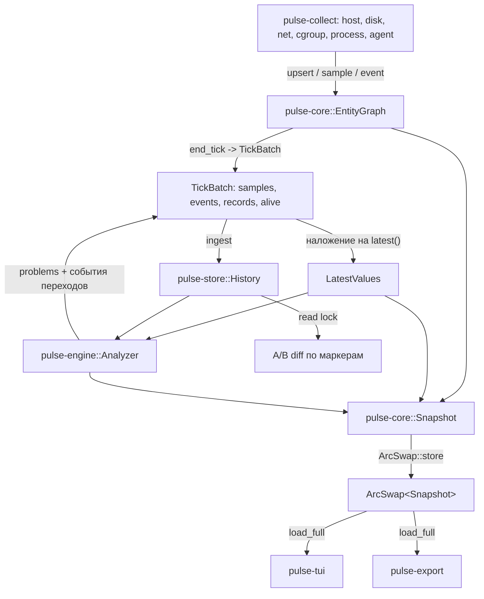

# Архитектура Pulse

Pulse — один процесс без внешних зависимостей: собирает телеметрию Linux, держит короткую историю в памяти, ставит диагнозы и отдаёт результат в TUI и в `/metrics`. Центральная модель данных — не `HashMap<MetricName, Series>`, а **temporal entity graph**: сущности с устойчивой идентичностью, их связи, телеметрия и события жизненного цикла. Из этого следуют и навигация в интерфейсе, и семантический A/B diff, и объяснимость диагноза.

## Крейты и границы ответственности

| Крейт | Отвечает за | Не отвечает за |
|---|---|---|
| `pulse-core` | домен: `EntityKey`/`EntityId`, `EntityGraph`, реестр метрик, `Event`, `Problem`, redaction, `Snapshot`, `Config` | ввод-вывод, сеть, терминал |
| `pulse-collect` | чтение `procfs`/`sysfs`/cgroup v2, парсеры, действия над процессами | хранение, диагностика |
| `pulse-store` | история: горячее кольцо, тёплые агрегаты, журналы сущностей и событий | правила, экспорт |
| `pulse-engine` | правила с гистерезисом, семантический A/B diff и скоринг доказательств | сбор, отрисовка |
| `pulse-export` | OpenMetrics по HTTP, аутентификация, лимиты | сбор, диагностика |
| `pulse-tui` | экраны, навигация, форматирование, восстановление терминала | сбор, хранение |
| `pulse-cli` | сборка конвейера, конфигурация, подкоманды, публикация снимка | доменная логика |

Зависимости направлены строго вниз: `pulse-core` ничего не знает о остальных крейтах, `pulse-collect`/`pulse-store` не знают о `pulse-tui`/`pulse-export`. Точные сигнатуры — в [CONTRACTS.md](CONTRACTS.md).

## Поток данных одного такта



Порядок в `pulse-cli::runtime::collect_loop` фиксирован и важен:

1. `graph.begin_tick(now)` — новый номер такта, буферы образцов и событий чисты.
2. каждый коллектор пишет наблюдения через `CollectCtx`; ошибка коллектора не прерывает такт, а становится событием `CollectorError`.
3. `graph.end_tick()` — исчезнувшие сущности объявляются удалёнными (фора один такт), формируется `TickBatch`.
4. `history.latest()` плюс образцы текущего такта дают `LatestValues`; значения мёртвых сущностей отбрасываются.
5. `Analyzer::evaluate` считает правила по `LatestValues` и истории **предыдущих** тактов, события переходов дописываются в тот же `TickBatch`.
6. `history.ingest(&batch)` — сначала записи сущностей, затем образцы и события.
7. `Snapshot::build` и публикация через `ArcSwap`.

Следствие шага 5: правило, которому нужна история, видит данные без текущего такта — задержка ровно один такт. Это сознательный компромисс: альтернатива — двойная запись в историю или запись до анализа, и тогда состояние правил зависело бы от порядка внутри такта.

## Три класса данных вместо одного

* **Entity** — устойчивая идентичность и связи. Живёт в `EntityGraph`, переживает смерть в `pulse-store::Entities` как `EntityRecord`.
* **Telemetry** — числовые серии, ключ `SeriesKey { entity, metric }` (12 байт, `Copy`). Реестр метрик закрыт: `MetricId` — статический `u16`, а не строка, поэтому cardinality контролируется на входе, а не в экспортёре.
* **Event** — переходы: создание, удаление, перезапуск, смена родителя, открытие и закрытие проблемы, ошибка коллектора. События не агрегируются никогда: именно они отвечают на вопрос «что изменилось».

Без всех трёх классов A/B diff невозможен: «процесс исчез, контейнер перезапустился, задержка диска выросла» — это записи сущностей, события и серии одновременно.

## Идентичность сущностей

| Вид | Ключ | Почему так |
|---|---|---|
| `Host` | `boot_id` из `/proc/sys/kernel/random/boot_id` | после перезагрузки те же PID и inode относятся к другой эпохе; склеивать историю через перезагрузку нельзя |
| `Process` | `(pid, start_ticks)`, где `start_ticks` — поле 22 `/proc/<pid>/stat` | PID переиспользуется ядром; без времени старта «тот же процесс» и «новый с тем же номером» неразличимы |
| `Cgroup` | inode каталога в cgroup v2 | `systemctl restart` пересоздаёт каталог (новый inode → новая сущность), переименование сохраняет inode (та же сущность) |
| `Unit` | полный путь cgroup относительно корня | базовое имя не уникально: `dbus.socket` существует и в системном, и в пользовательском менеджере; по имени они склеивались бы в одну сущность и дребезжали событиями `Reparented` |
| `Container` | `(runtime, id)`, выведено из сегмента пути cgroup | не требует прав на сокет демона и работает без запущенного runtime API |
| `Pod` | `(namespace, name)`; namespace пока `unknown` | из пути cgroup извлекается только UID pod; namespace требует Kubernetes API — не реализовано |
| `Disk`, `NetIf` | имя устройства | стабильно в пределах загрузки |

`EntityId` — индекс слота арены плюс поколение. Освобождённый слот получает новое поколение, поэтому устаревший `EntityId` не может «переехать» на другую сущность (проблема ABA). Любое имя из ядра проходит `sanitize_display` в `EntityGraph::upsert` — единственная точка входа имён в граф.

## Инварианты

* Идентичность определяется только `EntityKey`, а не порядком обхода `/proc`.
* Образцы принимаются только для живых сущностей текущего такта; не-finite значения отбрасываются.
* `EntityRecord` живёт после смерти сущности — до горизонта истории. Иначе diff не смог бы сказать «что исчезло».
* Counter-серии хранятся сырыми; скорость считается на чтении (`History::rate`), сброс счётчика обрабатывается суммированием положительных приращений.
* `WindowStats::approximate = true`, если статистика восстановлена из тёплых агрегатов. Потребитель обязан не делить на такой `stddev`: он занижен, и z-оценка была бы раздутой.
* Тексты доказательств строго корреляционные. Слова «вызвал», «причина», «caused» запрещены и проверяются тестами.
* Локальные карты предыдущих значений в коллекторах сжимаются каждый такт до реально существующих идентичностей — иначе они растут весь срок жизни агента на хосте с churn контейнеров.
* Данные процесса, неизменные в течение его жизни (командная строка, путь исполняемого файла, uid, лимит дескрипторов), читаются один раз на идентичность `(pid, start_ticks)`. Это убирает три обращения к ядру на процесс на каждом такте; изменение через `setuid`/`prctl` на живом процессе станет видно только после его перезапуска — осознанный компромисс.

## Стоимость такта

Замер релизной сборки на стенде WSL2 (12 ядер, интервал 1 с, 3 561 серия, 215 сущностей, сбор процессов включён):

| Величина | Значение |
|---|---|
| длительность такта, p95 | 13,6 мс (≈1,4% одного ядра) |
| RSS агента | 8,5 МиБ, из них история 2,2 МиБ |
| пропущенные такты | 0 |
| ошибки коллекторов | 0 |

Атрибуция: без сбора процессов такт занимает около 10,7 мс, то есть основная часть стоимости — обход cgroup и хостовые файлы, а не процессы. Доминирующий член — цена одного чтения `/proc`/`sysfs` под WSL2; на физическом Linux она ниже. Замер воспроизводится командой `pulse scorecard --seconds 20`.
## Стоимость памяти

Замер четырёх минут показывает ранний участок заполнения истории: на такте 86
объём снизился с 6,9 до 5,7 МиБ, на такте 241 — с 18,1 до 15,2 МиБ; рост упал
с 72 до 61 КиБ на такт. В этот момент горячее кольцо ещё не заполнено и
доминирует в приросте.

Плато через час — **расчёт**, а не измерение: около 80 МиБ до ограничения
тёплого слоя и около 34 МиБ после (из них горячее кольцо при `hot_ticks = 300`
занимает около 16 МиБ). Независимо от расчёта `store.max_bytes = 64 MiB` задаёт
потолок истории: сначала сокращается warm, затем hot, но не ниже двух тактов.
Минимальное живое состояние (сущности, события, два горячих такта) не удаляется,
поэтому заведомо нереальный лимит может быть превышен этим минимумом, но история
не продолжает расти.

## Модель потоков

```text
поток pulse-collect   : EntityGraph (владение), Analyzer (владение), History (запись)
поток pulse-export    : Snapshot (чтение через ArcSwap), без доступа к графу
основной поток / TUI  : Snapshot (чтение), History (чтение под RwLock только для A/B diff)
```

* Мутирует граф и состояние правил ровно один поток. Никакого разделяемого мутабельного домена нет.
* `Snapshot` неизменяем и публикуется целиком через `ArcSwap`: читатель никогда не видит полусобранное состояние и никогда не блокирует сбор.
* `History` за `Arc<RwLock<_>>`, потому что A/B diff читает историю целиком. Отравление замка (`poisoned`) не считается фатальным: данные структуры остаются согласованными, и код продолжает работу через `into_inner`.
* Внешние сигналы (`SIGTERM`, `SIGINT`, `SIGHUP`, `SIGQUIT`) переводятся в атомарный флаг **до** перехода терминала в raw-режим. Без этого внешний `kill` оставлял бы терминал в raw-режиме с альтернативным экраном.

## Хранение и retention

| Слой | Что хранит | По умолчанию |
|---|---|---|
| Горячее кольцо | сырые значения всех серий по тактам | 300 тактов ≈ 5 минут |
| Тёплый слой | агрегаты по бакетам, только метрики из списка `pulse_core::metric::LONG_WINDOW` (22), только для сущностей, не являющихся `Process` | 360 бакетов × 10 тактов ≈ 1 час |
| Журнал сущностей | `EntityRecord` живых и мёртвых | 32 768 записей |
| Журнал событий | без агрегации | 8 192 события |
Тёплый слой хранит агрегаты только метрик из списка
`pulse_core::metric::LONG_WINDOW` (22 метрики). Метрики вне списка живут только
в горячем кольце. Тот же список используется `pulse-engine` как `WATCHED`;
инвариант закреплён тестом `watched_metrics_are_retained_long`, поэтому diff не
запрашивает данные, которым не назначен длинный ретеншн.

`store.max_bytes` (64 МиБ по умолчанию, `0` отключает проверку) ограничивает
историю. Сначала отдаются старые бакеты warm; если этого недостаточно, hot
сокращается, но не ниже двух тактов. Журналы сущностей/событий и свежие значения
не удаляются. Вытеснения видны через `History::evicted_buckets()` и
`History::evicted_hot_ticks()`; первое пишет warning.

Жёсткий предел серий — 200 000; при переполнении новые серии не создаются, растёт `dropped_series`. Тёплый слой не ведётся для процессов сознательно: их на типовом хосте тысячи, а владельцев — десятки, и хранение процессов в тёплом слое увеличило бы память на порядок без пользы для расследования.

Агрегат — одна и та же ассоциативная функция `merge` на всех уровнях, а сырой образец — вырожденный агрегат с `count = 1`. Поэтому downsampling не превращается в два расходящихся кодовых пути.

## Диагностика

`Analyzer` держит гистерезис (вход после N подряд подтверждений, снятие после M) отдельно от правил: правило остаётся чистой функцией «значение → решение». Каждая проблема несёт `Evidence` — измеренную величину и пересечённый порог, поэтому интерфейс показывает не вердикт, а доказательство.

Скоринг доказательств в diff:

```text
score     = 0.35*magnitude + 0.25*temporal + 0.25*graph + 0.15*resource
magnitude = min(|z|, 4) / 4
temporal  = max(0, 1 - |t_anchor - t_evidence| / 120s); позже anchor -> 0
graph     = 1/(1+hops) по цепочкам родителей; hops > 4 -> 0
resource  = 1 при прямой ресурсной зависимости, иначе 0
```

Веса — константы, а не настройки: подгонка весов без корпуса реальных инцидентов была бы самообманом.

## Слой интерфейса

`pulse-tui` не является «рендерером снимка»: интерфейс — часть архитектуры,
потому что определяет, какие клавиши доступны.

Инвариант: `visible UI state == focus state == keyboard target`. `App` держит
всё состояние интерфейса, `App::dispatch` — единственный вход событий
(порядок: overlay → Inspector → focused visible pane → global), а renderer
каждый кадр публикует фактически нарисованные панели через
`App::set_visible_panes`. Скрытая раскладкой строка не может получить `Enter`.

Раскладка не растягивается: `layout::bounded` ограничивает каждый блок
`max_useful_width`, а свободная ширина уходит в дополнительный контекст
(Selected/Context) либо остаётся намеренной пустотой. Источник истины по
геометрии и семантике экранов — `pulse_tui_visual_navigation_spec_v0.9.md`
(append-only, поздний раздел выигрывает), проверяется тестами приёмки
`pulse-tui/src/screens/acceptance.rs` на размерах 60×18 … 200×50.

Отрисовка не выдумывает данные: metric lanes рисуют спарклайн только при
наличии ≥2 реальных точек из `History::series_points`, иначе пишут
`collecting history`; утверждения о стабильности ограничены фактическим окном
наблюдения, а не аптаймом хоста.

## Семантический слой

Коллекторы наблюдают, `pulse-core::semantic` решает, что из наблюдений является
изменением. Без этого слоя экраны показывали поток переименований per-cpu
воркеров ядра вместо диагностики: на реальном хосте это 320 событий за такт.

```text
collectors → TickBatch.events → History (raw, retention)
                                   ↓
                      Snapshot::build → semantic::summarize
                                   ↓
             meaningful  →  Recent Changes / Story / relevance
             events      →  `: raw events`
```

Сырые данные не уничтожаются: фильтрация относится к представлению, а не к
хранению. Экраны читают `Snapshot::meaningful`, эксперт — `Snapshot::events`.

## Порядок вытеснения истории

Потолок памяти — жёсткая граница, а не пожелание. Вытеснение идёт от наименее
ценного к наиболее ценному и обязано давать прогресс на каждом шаге:

```text
warm buckets → hot ticks (≥2) → сырые события → мёртвые записи сущностей
```

Живые записи и последние значения серий не отдаются никогда. Шаг без прогресса
завершает цикл: повторная попытка при нулевом прогрессе и была причиной
production-инцидента с загрузкой ядра на 100%.

## Текущие ограничения

* **Абсурдно малый `store.max_bytes` честно превышается.** Минимальное живое
  состояние (два такта, живые записи, последние значения) не вытесняется;
  превышение видно счётчиком `history_eviction_no_progress`, а не зависанием.
* **Классификация потоков ядра — эвристика по префиксам имён.** Новый префикс в
  будущем ядре до его добавления будет считаться операционным изменением.
* **В TUI-режиме журнал `tracing` не виден без `PULSE_LOG`.** Это цена запрета
  писать в терминал, которым владеет ratatui.
* **История только в памяти.** Перезапуск теряет её; дисковая персистентность не реализована. `pulse diff` с относительным временем сам набирает окно и ограничен пятью минутами.
* **Никаких внешних адаптеров телеметрии.** eBPF, Docker/CRI/Kubernetes API, OTLP, Prometheus Remote Read/Write не реализованы. Контейнеры и pod определяются эвристикой по пути cgroup.
* **Один узел.** Кластера и центрального backend нет.
* **Только Linux с cgroup v2.** Зависимость от `procfs`, `sysfs` и cgroup v2 принципиальна.
* **Без TLS.** Экспортёр отдаёт HTTP; для внешней публикации нужен reverse proxy с TLS.
* Namespace pod не определяется; в метках он остаётся `unknown`.

## Решения, зафиксированные отдельно

* [ADR 0001 — temporal entity graph как центральная модель](adr/0001-temporal-entity-graph.md)
* [ADR 0002 — история в памяти](adr/0002-in-memory-history.md)
* [ADR 0003 — публикация снимка одним процессом](adr/0003-single-process-snapshot-publication.md)
* [ADR 0004 — authoritative UI state и однократная маршрутизация ввода](adr/0004-authoritative-ui-state.md)
